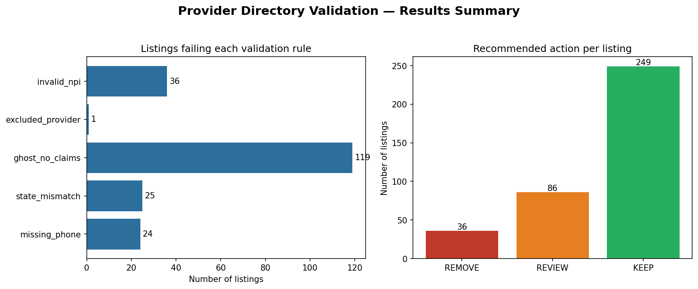

# Provider Directory Validation Pipeline

A federated data-quality pipeline that detects **"ghost network"** entries in
healthcare provider directories by validating listings against authoritative
federal sources (NPPES, OIG LEIE) and claims activity.

Built on a modern data stack (Python, SQL, DuckDB, medallion architecture) as a
hands-on exploration of provider-directory accuracy — a well-documented problem
in healthcare data engineering.



## The problem

Health plan provider directories are notoriously inaccurate. CMS audits have
repeatedly found that ~45–50% of provider listings contain at least one error:
a wrong location, a disconnected phone, or a provider who isn't actually seeing
patients (a "ghost"). These inaccuracies make it hard for members to find care
and create compliance exposure for plans.

The modern fix is to stop treating the directory as self-evident and instead
**cross-validate every listing against independent authoritative sources.**
That's a data-engineering problem, and that's what this pipeline does.

## What it does

It runs a **federated validation framework** — each listing is judged against
several independent sources, not one:

| Check | Source it validates against | Severity |
|-------|----------------------------|----------|
| Invalid NPI | NPPES federal registry | high |
| Excluded provider | OIG LEIE exclusions list | critical |
| Ghost (no claims) | claims activity feed | high |
| State mismatch | NPPES registry | medium |
| Missing phone | internal completeness | low |

Each listing gets a **weighted trust score (0–100)** and a **recommended action**
(`REMOVE` / `REVIEW` / `KEEP`), so the output is directly actionable.

## Results on the sample dataset

- **371** directory listings validated against **354** real providers,
  **83,256** real OIG exclusion records, and **2,783** claims
- **41.5%** of listings failed at least one check — in line with real CMS audit findings
- Surfaced **1 real OIG-excluded provider** from live federal data
- Output: **36 REMOVE**, **86 REVIEW**, **249 KEEP**

## Architecture

Medallion architecture (bronze → silver → gold). Full diagram:
[`docs/architecture.md`](docs/architecture.md).
## Tech stack

`Python` · `SQL` · `DuckDB` · `pandas` · `Great Expectations` · `matplotlib`

DuckDB is used as a local stand-in for a cloud warehouse. The patterns map
directly to production:

| This demo | Production at scale |
|-----------|--------------------|
| DuckDB | Snowflake / Redshift / Trino |
| Local CSV | S3 + Apache Iceberg |
| Python scripts | dbt + Spark |
| Manual run | Airflow / Argo |

## Run it yourself

```bash
python3 -m venv venv && source venv/bin/activate
pip install duckdb pandas dbt-duckdb great-expectations faker requests matplotlib

python3 scripts_fetch_data.py     # fetch real + generate synthetic data
python3 pipeline/bronze.py        # raw ingestion
python3 pipeline/silver.py        # clean & standardize
python3 pipeline/validate.py      # federated validation
python3 pipeline/gold.py          # trust scores + actions
python3 pipeline/visualize.py     # summary chart
```

All data is either public federal data or synthetic — **no PHI** is used or stored.

## Notes & honest limitations

- The directory and claims feeds are **synthetic** (seeded for reproducibility),
  with realistic errors injected so results can be verified against known ground truth.
- Name-based exclusion matching is intentionally conservative; production systems
  would add fuzzy matching, address normalization, and taxonomy checks.
- This is a learning project exploring the problem space, not a production system.
