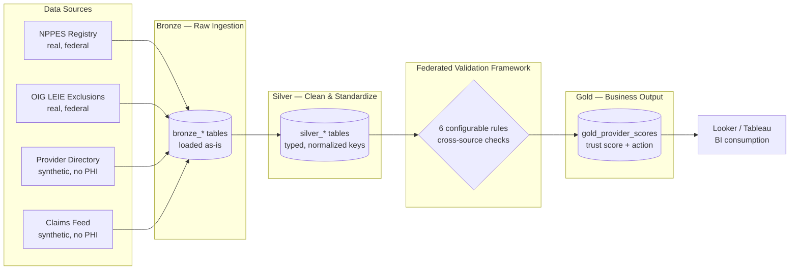

# Architecture

## Layer responsibilities

- **Bronze:** land raw data safely as text; never lose the original.
- **Silver:** trim, uppercase, normalize NPIs, convert blanks to NULL, type dates/numbers.
- **Validation:** federated rules cross-reference each listing against NPPES, OIG, and claims.
- **Gold:** weighted trust score (0–100) and a REMOVE / REVIEW / KEEP action per listing.

## Production mapping

| This demo | Production equivalent at scale |
|-----------|-------------------------------|
| DuckDB | Snowflake / Redshift / Trino |
| Local CSV | S3 + Apache Iceberg tables |
| Python scripts | dbt models + Spark jobs |
| Manual run | Airflow / Argo orchestration |
